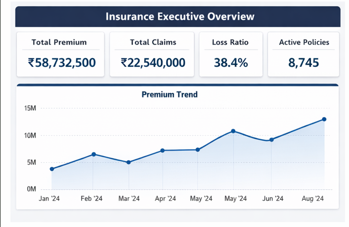

# Insurance-Executive-Analytics-Dashboard
# 🛡️ Insurance Analytics Dashboard

## 📌 Project Overview
This Power BI dashboard analyzes insurance business performance, including premium revenue, claims, agent performance, risk analysis, and customer retention.

---

## 🎯 Problem Statement
Insurance companies manage large volumes of policy and claims data. Manual analysis is time-consuming, making it difficult to identify business trends and support decision-making. This dashboard provides interactive insights for faster and more effective analysis.

---

## 🎯 Objectives
- Analyze premium revenue
- Monitor claims performance
- Track agent productivity
- Identify high-risk policies
- Improve customer retention analysis

---

## 🛠️ Tools Used
- Power BI
- Power Query
- DAX
- Microsoft Excel

---

## 📊 Dashboard Pages

### 1. Executive Overview
- Total Premium
- Total Claims
- Loss Ratio
- Active Policies
- Premium Trend

### 2. Claims Analysis
- Claims Status
- Claim Approval Rate
- Average Settlement Days
- Claims by Policy Type

### 3. Agent Performance
- Top Agents
- Claims per Agent
- Agent Loss Ratio

### 4. Risk & Retention
- High Risk Policies
- Policy Lapse Rate
- Premium vs Claims
- Retention Trend

---

## 📈 Key KPIs
- Total Premium
- Total Claims Amount
- Loss Ratio %
- Active Policies
- Claim Approval Rate %
- Policy Lapse Rate %

---

## 💡 Business Insights
- Identified top-performing agents.
- Tracked premium growth.
- Analyzed claim approval trends.
- Identified high-risk regions.
- Monitored customer retention.

---

## ⚡ Challenges
- Data cleaning
- Data modeling
- DAX calculations
- KPI validation

---

## 📷 Dashboard Screenshots
### Executive Overview

### Claims Analysis

### Agent Performance

### Risk & Retention

---

🚀 Future Enhancements

- 🔄 Enable real-time data refresh.
- 📊 Add predictive analytics for claim and premium forecasting.
- 🔍 Implement drill-through reports for detailed analysis.
- 🔐 Apply Row-Level Security (RLS) for secure user access.

---

✅ Conclusion

The Insurance Executive Analytics Dashboard transforms raw insurance data into meaningful business insights using interactive Power BI visualizations. It helps analyze premium revenue, claims performance, agent productivity, risk exposure, and customer retention, enabling better data-driven decision-making. This project demonstrates practical skills in Power BI, Power Query, DAX, data modeling, and business intelligence reporting.

